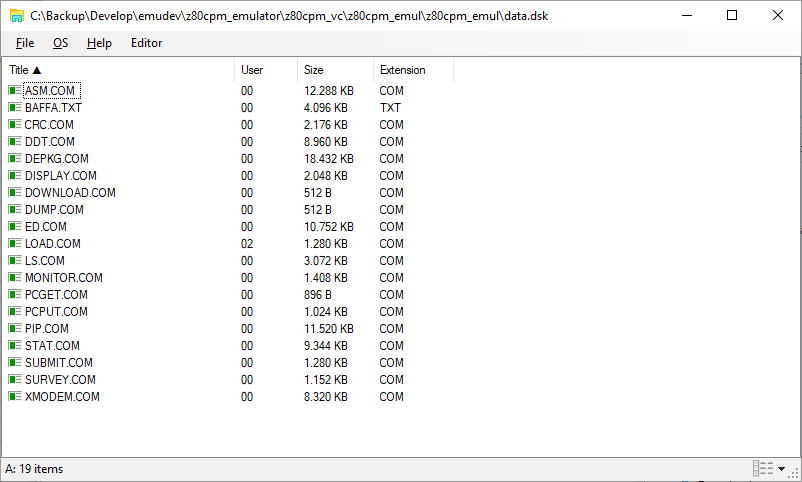
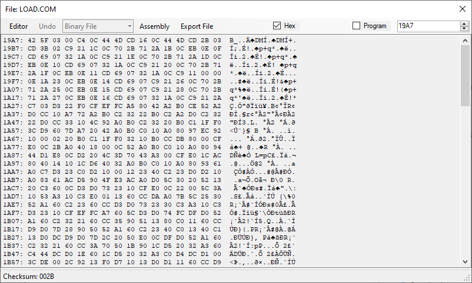
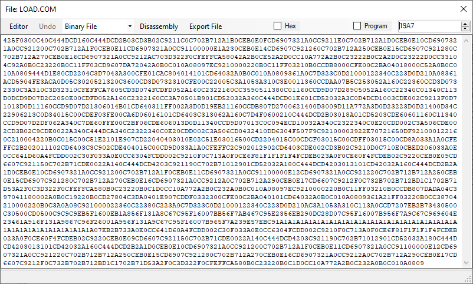

# CP/M Disk Manager 
 
 Compatible with CP/M on breadboard by Grant Searle (http://searle.x10host.com/cpm/index.html)
 and RC2014 by Spencer Owen (https://rc2014.co.uk/)

This is a disk manager for CP/M disk format using a 64MB/128MB Compact Flash proposed by Grant Searle.

The emulator software is available at https://github.com/abaffa/z80cpm_emulator and was the landmark for [Baffa-2 Homebrew Microcomputer Project](https://baffa-2.baffasoft.com.br)

File data.dsk is an example of disk image.

To read the CFCard/SDCard it's necessary to run as administrator to have disk raw access priviledges. 

PS: This program uses the RawDiskLib.dll from Visual Studio 2017 to access (read/write) raw data from removable disks. As it has that raw disk access feature, some antivirus programs are erroneously reporting it as malware. This is a false positive and should be ignored! Btw the raw disk access only is available and accessible if the program is run with administrative privileges.

-----BEGIN LICENSE NOTICE----- 

CP/M Disk Manager for Z80 CPM Emulator

Copyright (C) 2021  Augusto Baffa, (cpm.baffasoft.com.br)

This program is free software; you can redistribute it and/or
modify it under the terms of the GNU General Public License
as published by the Free Software Foundation; either version 2
of the License, or (at your option) any later version.

This program is distributed in the hope that it will be useful,
but WITHOUT ANY WARRANTY; without even the implied warranty of
MERCHANTABILITY or FITNESS FOR A PARTICULAR PURPOSE.  See the
GNU General Public License for more details.

You should have received a copy of the GNU General Public License
along with this program; if not, write to the Free Software
Foundation, Inc., 51 Franklin Street, Fifth Floor, Boston, MA  02110-1301, USA.

-----END LICENSE NOTICE----- 
